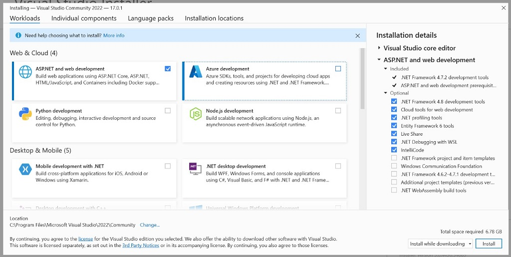

# Ticket Viewer Application (.NET Core 5.0)
To view tickets raised by clients with the help of 3rd party integrations in SAAS products.

**Name: Bhishma Sukhavasi**  
**Email: bhishma.sukhavasi@gmail.com**

## Tech Stack
**Framework:** .NET 5.0, ASP.NET Core  
**Programming Languages:** C#, JavaScript, HTML, CSS  
**Unit Testing:** xUnit.net  
**Third party libraries:** AutoMapper(10.1.1) Nuget, Newtonsoft.Json(13.0.1) Nuget

## Application local setup

Is .NET only for windows machines?  
**Well it used to be, but the latest versions of .NET entirely build again as ".NET Core" given cross-platform support (Yes this is too WORA)**

Is Application Setup using .NET a complex process?  
**No, not at all. Just follow few simple steps given below**

### Steps: 
- **Download & Install Visual Studio IDE**  
For Windows (Visual Studio Community Version): https://visualstudio.microsoft.com/thank-you-downloading-visual-studio/?sku=Community&rel=17  
For Mac: https://visualstudio.microsoft.com/vs/mac/  
**Installation:**  

- **Download & Install .NET 5 SDK based on your OS**  
.NET 5 SDK: https://dotnet.microsoft.com/download/dotnet/5.0  
**Installation:**  

- Visual studio install guide for reference: https://docs.microsoft.com/en-us/visualstudio/install/install-visual-studio?view=vs-2022

- **Clone the Repo:** https://github.com/BhishmaS/TicketViewer.git

- **Now Open the Solution TicketViewer.sln using visual studio from the root directory of the project.**  
 

- All the required project nugut dependencies will be automatically restored or else you can restore as shown below.  
 

### Running the application

- By default web app will be startup if not, update that as shown below:  
 

- Run the application  
 
